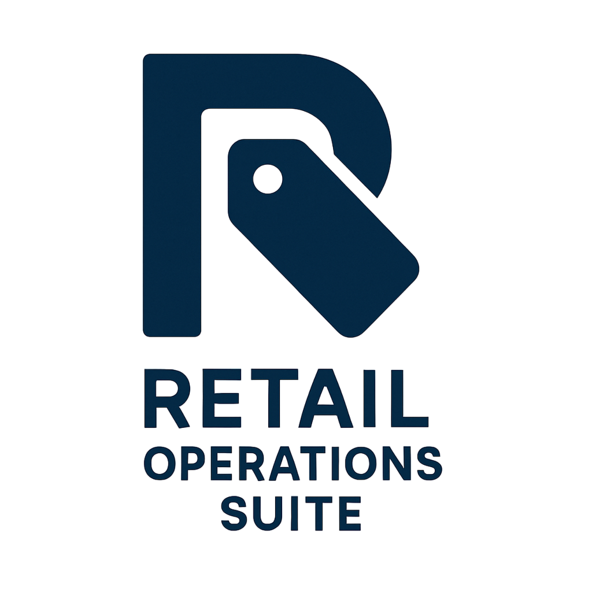

<div align="center">
  
  <h1>Retail Operations Suite</h1>
  <p>
    A comprehensive desktop application for managing retail price tags, inventory status, and administrative tasks, built with PyQt6 and Firebase.
  </p>
  <p>
    
    
    
  </p>
</div>

---

The **Retail Operations Suite** is a powerful, real-time tool designed to streamline in-store operations for retail environments. It provides a robust interface for generating dynamic price tags, managing product data, and offers a suite of administrative tools for comprehensive oversight.

## ✨ Key Features

*   **🏷️ Dynamic Price Tag Generation**:
    *   Create price tags in multiple, fully customizable sizes, including standard, compact "accessory-style", and a specialized "keyboard" layout.
    *   Live preview of the price tag as you edit details.
    *   Theming engine for seasonal or promotional branding (e.g., "Winter" theme with snowflakes ❄️).
    *   Automatic dual-language (English/Georgian) tag generation.

*   **📝 Intelligent Specification Handling**:
    *   Automatically pairs related data columns (e.g., `c1` & `c2`) into clean "Key: Value" specifications like "Audio: Poly Audio".
    *   Extracts specs from multiple data sources, including HTML descriptions and top-level product attributes.
    *   For the keyboard layout, it dynamically cleans the product name by removing redundant words that are already present in the displayed specifications (e.g., "Razer Ornata Wired Mechanical" becomes "Razer Ornata" if "Wired" and "Mechanical" are shown as specs).

*   **⚡ Real-Time Firebase Integration**:
    *   Real-time synchronization of all product data, display statuses, and user information.
    *   Secure authentication system allowing login with either email or a unique username.

*   **🏪 Branch & Inventory Management**:
    *   Track which items are on display versus in storage for each branch, including the duration they've been on display.
    *   "Quick Stock Checker" utility to instantly view inventory levels for an item across all branches.
    *   "Display Manager" tool to find suitable, in-stock replacements for returned items based on product category.

*   **📊 Advanced Admin Dashboard**:
    *   At-a-glance statistics for items currently on display in each branch.
    *   A powerful, filterable list of items with low stock.
    *   Filter by specific branch or product category.
    *   Sortable and resizable columns for easy data analysis.

## 🛠️ Admin Tools

Admins have access to a suite of powerful tools to manage the application and data:

*   **👥 User & Role Management**:
    *   Distinct Admin and User roles with different permissions.
    *   Admins can promote other users to the Admin role.

*   **🎨 Data & Template Customization**:
    *   **Template Manager**: Define product categories and specification templates to standardize and speed up new item registration.
    *   **Custom Size Manager**: Define new custom print sizes, including the option for compact "accessory" or other specialized layouts.
    *   **Column Mapping Manager**: Customize how raw product attributes are displayed. Set user-friendly "Display Names" for technical field names or choose to ignore certain attributes entirely so they don't appear in the specs list.

*   **👁️ System & Activity Oversight**:
    *   **Master List Sync**: Upload a master `.txt` file to perform a full synchronization of the product database.
    *   **Activity Log**: View a log of important actions taken by users, such as logins, data syncs, and template updates.
    *   **Print Queue**: A persistent, user-specific queue for batch printing. Admins can also save and load frequently used lists of SKUs.

## 📸 Screenshots

|               Main Generator Window                |                      Admin Dashboard                       |
|:--------------------------------------------------:|:----------------------------------------------------------:|
|  |  |

|                        Custom Size Manager                        |                        Quick Stock Checker                         |
|:-----------------------------------------------------------------:|:------------------------------------------------------------------:|
|  |  |


## 💻 Technology Stack

*   **Framework**: PyQt6
*   **Database**: Firebase Realtime Database
*   **Authentication**: Firebase Authentication
*   **Image Processing**: Pillow
*   **Data Parsing**: Beautiful Soup
*   **Languages**: Python

## 📦 Setup and Installation

To get the project running locally, follow these steps:

1.  **Clone the repository:**
    ```bash
    git clone https://github.com/tnicko1/Retail-Operations-Suite
    cd Retail-Operations-Suite-dev
    ```

2.  **Create a virtual environment and activate it:**
    ```bash
    # For Windows
    python -m venv .venv
    .\.venv\Scripts\activate

    # For macOS/Linux
    python3 -m venv .venv
    source .venv/bin/activate
    ```

3.  **Install the required dependencies:**
    ```bash
    pip install -r requirements.txt
    ```

4.  **Configure Firebase:**
    *   In the project root, you will find a file named `config.template.json`.
    *   **Make a copy** of this file and rename it to `config.json`.
    *   Open the new `config.json` and fill in your actual Firebase project configuration credentials. You can get these from your Firebase project settings ("Project Overview" > "Project settings" > "General" > "Your apps" > "SDK setup and configuration").
    *   **The `config.json` file is included in `.gitignore` and will not be committed to the repository.** This is critical for keeping your project keys secure.

5.  **Run the application:**
    ```bash
    python main.py
    ```

## 📜 Licensing

This project is dual-licensed to accommodate both open-source and commercial needs.

#### Open-Source License

The **Retail Operations Suite** is free software, licensed under the **GNU General Public License v3.0 (GPLv3)**. You are free to use, modify, and redistribute this software under the terms of the GPLv3. A full copy of the license is available in the `LICENSE` file.

This means that any derivative works you create and distribute must also be licensed under the GPLv3 and you must make your source code available.

#### Commercial License

If you wish to use this software in a proprietary, closed-source commercial product without being bound by the copyleft terms of the GPLv3, a commercial license is required.

For commercial licensing options, please contact the author directly.

## 👨‍💻 Author

This project was created with passion by **Nikoloz Taturashvili (ნიკოლოზ ტატურაშვილი)**, a Computer Science student at Tbilisi State University (TSU).

For inquiries, please contact: `tnicko@proton.me`
