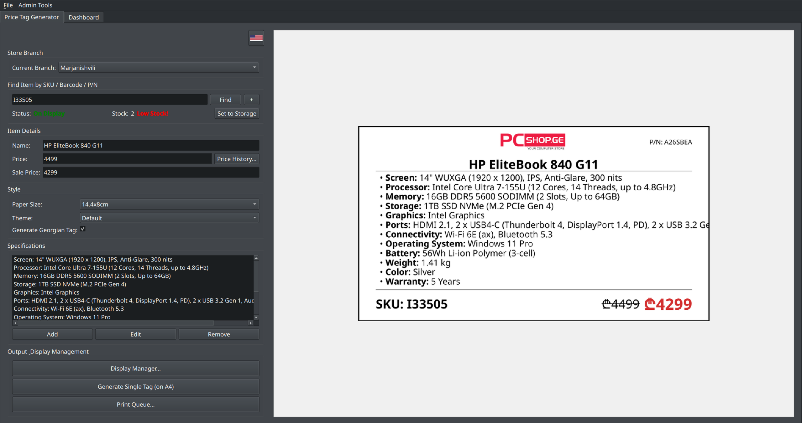
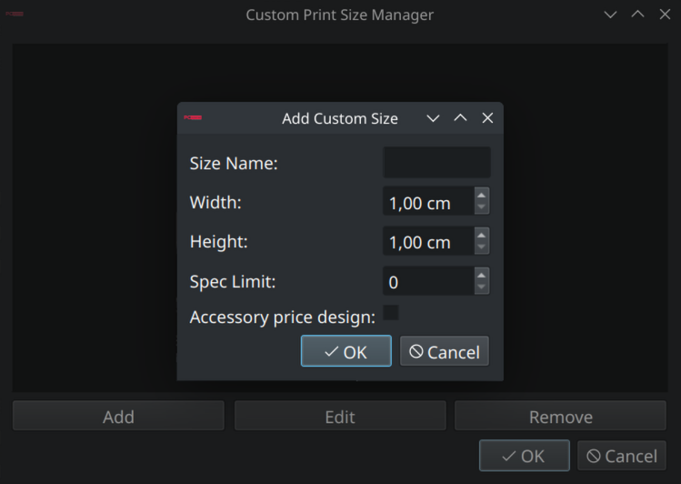

<div align="center">
  
  <h1>Retail Operations Suite</h1>
  <p>
    A comprehensive desktop application for managing retail price tags, inventory status, and administrative tasks, built with PyQt6 and Firebase.
  </p>
  <p>
    
    
    
  </p>
</div>

---

The **Retail Operations Suite** is a powerful, real-time tool designed to streamline in-store operations for retail environments. It provides a robust interface for generating dynamic price tags, managing product data, and offers a suite of administrative tools for comprehensive oversight.

## ✨ Key Features

* **Dynamic Price Tag Generation**:
    * Create price tags in multiple, fully customizable sizes.
    * Support for standard and compact "accessory-style" designs.
    * Theming engine for seasonal or promotional branding (e.g., "Winter" theme).
    * Automatic dual-language (English/Georgian) tag generation.
    * Live preview of the price tag as you edit details.

* **Firebase Integration**:
    * Real-time synchronization of all product data, display statuses, and user information.
    * Secure authentication system allowing login with either email or a unique username.

* **Admin Dashboard**:
    * At-a-glance statistics for items currently on display in each branch.
    * A powerful, filterable list of items with low stock.
    * Filter by specific branch or product category.
    * Sortable and resizable columns for easy data analysis.

* **Advanced User & Role Management**:
    * Admin and User roles with distinct permissions.
    * Admins can manage users, templates, custom print sizes, and view the activity log.

* **Product & Display Management**:
    * Track which items are on display versus in storage for each branch.
    * "Display Manager" tool to find suitable replacements for returned items based on category and stock.
    * "Quick Stock Checker" utility to view inventory levels across all branches instantly.

* **Customization for Admins**:
    * **Template Manager**: Define product categories and specification templates to speed up new item registration.
    * **Custom Size Manager**: Define new custom print sizes, including the option for a compact "accessory" layout.

## 📸 Screenshots

*(You should add screenshots of your application here to showcase its features. Below are some placeholder examples.)*

|               Main Generator Window                |                      Admin Dashboard                       |
|:--------------------------------------------------:|:----------------------------------------------------------:|
|  |  |

|                        Custom Size Manager                        |                        Quick Stock Checker                         |
|:-----------------------------------------------------------------:|:------------------------------------------------------------------:|
|  |  |


## 🛠️ Technology Stack

* **Framework**: PyQt6
* **Database**: Firebase Realtime Database
* **Authentication**: Firebase Authentication
* **Image Processing**: Pillow
* **Languages**: Python

## ⚙️ Setup and Installation

To get the project running locally, follow these steps:

1.  **Clone the repository:**
    ```bash
    git clone [your-repository-url]
    cd RetailOperationsSuite
    ```

2.  **Create a virtual environment and activate it:**
    ```bash
    # For Windows
    python -m venv .venv
    .\.venv\Scripts\activate

    # For macOS/Linux
    python3 -m venv .venv
    source .venv/bin/activate
    ```

3.  **Install the required dependencies:**
    ```bash
    pip install -r requirements.txt
    ```

4.  **Configure Firebase:**
    * Create a `config.json` file in the root directory of the project.
    * This file must contain your Firebase project configuration credentials. You can get these from your Firebase project settings.
    * **This file is critical for the application to connect to your database.**

    *`config.json` template:*
    ```json
    {
      "apiKey": "AIzaSy...",
      "authDomain": "your-project-id.firebaseapp.com",
      "databaseURL": "[https://your-project-id.firebaseio.com](https://your-project-id.firebaseio.com)",
      "storageBucket": "your-project-id.appspot.com",
      "serviceAccount": "path/to/your/serviceAccountKey.json"
    }
    ```

5.  **Run the application:**
    ```bash
    python main.py
    ```

## 📜 Licensing

This project is dual-licensed to accommodate both open-source and commercial needs.

#### Open-Source License

The **Retail Operations Suite** is free software, licensed under the **GNU General Public License v3.0 (GPLv3)**. You are free to use, modify, and redistribute this software under the terms of the GPLv3. A full copy of the license is available in the `LICENSE` file.

This means that any derivative works you create and distribute must also be licensed under the GPLv3 and you must make your source code available.

#### Commercial License

If you wish to use this software in a proprietary, closed-source commercial product without being bound by the copyleft terms of the GPLv3, a commercial license is required.

For commercial licensing options, please contact the author directly.

## 👨‍💻 Author

This project was created with passion by **Nikoloz Taturashvili (ნიკოლოზ ტატურაშვილი)**, a Computer Science student at Tbilisi State University (TSU).

For inquiries, please contact: `tnicko@proton.me`
